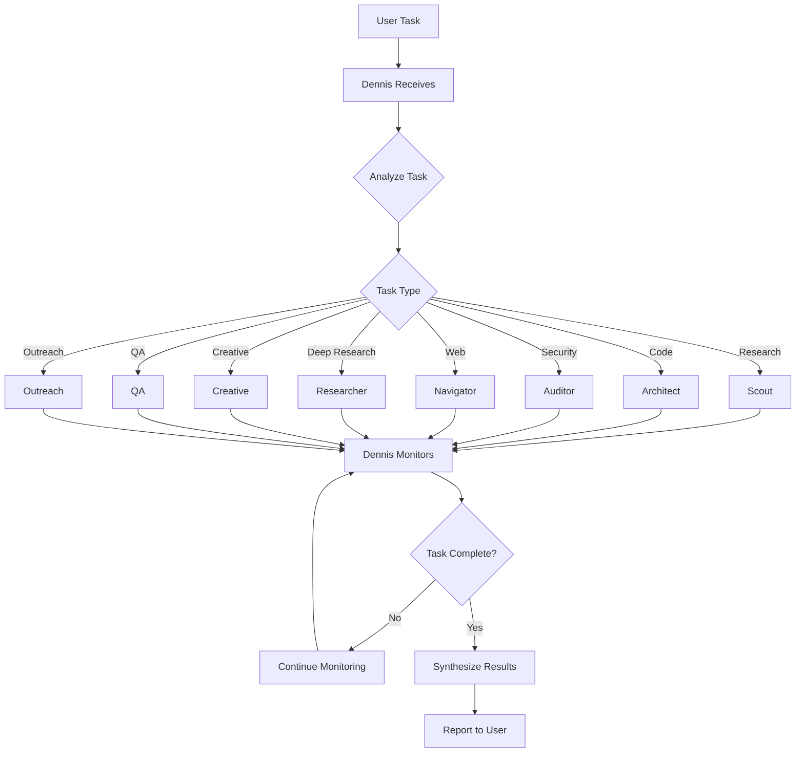

# Dennis Agent System - Architecture

## Overview

Dennis is the orchestrator agent that receives tasks from the user and assigns them to specialized sub-agents. Each sub-agent has specific capabilities and responsibilities.

## System Architecture

```
┌─────────────────────────────────────────────────────────────┐
│                         USER                                 │
└──────────────────────┬──────────────────────────────────────┘
                       │
                       ▼
┌─────────────────────────────────────────────────────────────┐
│                      DENNIS                                  │
│                   (Orchestrator)                             │
│                                                             │
│  - Receives tasks from user                                  │
│  - Analyzes task requirements                                │
│  - Routes to appropriate sub-agents                          │
│  - Monitors progress                                         │
│  - Synthesizes results                                       │
│  - Reports back to user                                      │
└──────────────────────┬──────────────────────────────────────┘
                       │
        ┌──────────────┼──────────────┬──────────────┐
        ▼              ▼              ▼              ▼
  ┌──────────┐  ┌──────────┐  ┌──────────┐  ┌──────────┐
  │  Scout   │  │Architect │  │  Auditor │  │Navigator │
  │(Intel)   │  │  (Code)  │  │(Security)│  │(Browser) │
  └──────────┘  └──────────┘  └──────────┘  └──────────┘
        │              │              │              │
        └──────────────┼──────────────┼──────────────┘
                       ▼              ▼
                ┌──────────┐  ┌──────────┐
                │Researcher│  │ Creative │
                │(Scholar) │  │(Visionary)│
                └──────────┘  └──────────┘
                       │              │
        ┌──────────────┼──────────────┼──────────────┐
        ▼              ▼              ▼              ▼
  ┌──────────┐  ┌──────────┐  ┌──────────┐  ┌──────────┐
  │    QA    │  │ Outreach │  │          │  │          │
  │(Janitor) │  │ (Closer) │  │          │  │          │
  └──────────┘  └──────────┘  └──────────┘  └──────────┘
```

## Agent Specifications

### 1. Dennis - The Orchestrator 🎯

**Purpose:** Central coordinator for all agent operations

**Responsibilities:**
- Receive tasks from user
- Analyze task type and requirements
- Determine which sub-agent(s) to assign
- Monitor sub-agent progress
- Synthesize results from multiple agents
- Report final results to user
- Handle escalations and errors
- Manage agent communication

**Key Capabilities:**
- Task classification and routing
- Multi-agent coordination
- Progress tracking
- Result synthesis
- Error handling and recovery

---

### 2. Scout - The Intelligence Agent 🕵️

**Purpose:** Research and information gathering

**Responsibilities:**
- Market research
- Competitive intelligence
- Information gathering
- Market analysis
- Industry trends
- Price comparisons
- Product research

**Key Capabilities:**
- Web searching
- Data collection
- Market analysis
- Competitor tracking
- Trend identification

---

### 3. Architect - The Lead Code Writer 🏗️

**Purpose:** System design and technical architecture

**Responsibilities:**
- System design and architecture
- Lead code writing
- Technical specifications
- Code reviews
- Database design
- API design
- Infrastructure planning

**Key Capabilities:**
- System architecture
- Database schema design
- API design
- Code generation
- Technical documentation

---

### 4. Auditor - The Security & Cron Agent 🔒

**Purpose:** Security audits and system monitoring

**Responsibilities:**
- Security audits
- Cron job management
- System monitoring
- Quality assurance
- Performance monitoring
- Log analysis
- Security vulnerability scanning

**Key Capabilities:**
- Security analysis
- Cron job scheduling
- System health checks
- Log monitoring
- Performance metrics

---

### 5. Navigator - The Browser Operator 🧭

**Purpose:** Web operations and browser automation

**Responsibilities:**
- Web operations
- Browser automation
- Web scraping
- Form submissions
- API interactions
- Website testing
- Cross-browser testing

**Key Capabilities:**
- Browser control
- Web scraping
- Form automation
- Screenshot capture
- API interaction
- Multi-browser testing

---

### 6. Researcher - The Scholar 📚

**Purpose:** Deep research and knowledge management

**Responsibilities:**
- Deep research
- Documentation
- Knowledge management
- Academic research
- Literature review
- Data analysis
- Report writing

**Key Capabilities:**
- In-depth research
- Documentation
- Knowledge synthesis
- Academic writing
- Data analysis
- Literature review

---

### 7. Creative - The Visionary 🎨

**Purpose:** Creative tasks and content creation

**Responsibilities:**
- Creative tasks
- Image generation
- Design work
- Content creation
- Copywriting
- Visual design
- Brand assets

**Key Capabilities:**
- Image generation
- Creative writing
- Design concept creation
- Brand development
- Content ideation

---

### 8. QA - The Janitor 🔧

**Purpose:** Maintenance and quality assurance

**Responsibilities:**
- Routine checks
- Code quality
- Testing
- Lead quality assurance
- Bug tracking
- Performance testing
- User acceptance testing

**Key Capabilities:**
- Automated testing
- Code review
- Quality metrics
- Bug tracking
- Performance testing
- Test plan creation

---

### 9. Outreach - The Closer 🤝

**Purpose:** Business development and outreach

**Responsibilities:**
- Business development
- Outreach campaigns
- Client communications
- Sales automation
- Lead generation
- Email campaigns
- Social media outreach

**Key Capabilities:**
- Email automation
- Lead generation
- CRM integration
- Sales automation
- Outreach sequencing
- Campaign management

---

## Task Routing Logic

```python
def route_task(task_description, task_type):
    """
    Routes tasks to appropriate sub-agents based on type
    """
    routing_map = {
        'research': 'scout',
        'market_analysis': 'scout',
        'competitive_intelligence': 'scout',
        
        'coding': 'architect',
        'system_design': 'architect',
        'architecture': 'architect',
        'code_review': 'architect',
        
        'security': 'auditor',
        'cron': 'auditor',
        'monitoring': 'auditor',
        'system_check': 'auditor',
        
        'web_automation': 'navigator',
        'browser': 'navigator',
        'scraping': 'navigator',
        'web_testing': 'navigator',
        
        'deep_research': 'researcher',
        'documentation': 'researcher',
        'analysis': 'researcher',
        
        'creative': 'creative',
        'image': 'creative',
        'design': 'creative',
        'content': 'creative',
        
        'testing': 'qa',
        'quality': 'qa',
        'maintenance': 'qa',
        'bug_check': 'qa',
        
        'outreach': 'outreach',
        'business': 'outreach',
        'sales': 'outreach',
        'email': 'outreach',
    }
    
    return routing_map.get(task_type, 'scout')  # Default to scout
```

## Communication Protocol

### Agent Communication Flow

1. **User → Dennis**: Task request
2. **Dennis → Sub-Agent**: Task assignment with context
3. **Sub-Agent → Dennis**: Progress updates
4. **Sub-Agent → Dennis**: Final result
5. **Dennis → User**: Synthesized report

### Message Format

```json
{
  "from": "agent_name",
  "to": "agent_name",
  "task_id": "unique_id",
  "type": "assignment|update|result|error",
  "data": {
    "task": "Task description",
    "context": {},
    "result": {},
    "status": "pending|in_progress|complete|failed"
  },
  "timestamp": "ISO 8601 timestamp"
}
```

## Task Execution Workflow



## Implementation Structure

```
clawd-dmitry/
├── agents/
│   └── dennis/
│       ├── SOUL.md
│       ├── CAPABILITIES.md
│       └── PROTOCOL.md
└── subagents/
    ├── scout/
    │   ├── SOUL.md
    │   └── CAPABILITIES.md
    ├── architect/
    │   ├── SOUL.md
    │   └── CAPABILITIES.md
    ├── auditor/
    │   ├── SOUL.md
    │   └── CAPABILITIES.md
    ├── navigator/
    │   ├── SOUL.md
    │   └── CAPABILITIES.md
    ├── researcher/
    │   ├── SOUL.md
    │   └── CAPABILITIES.md
    ├── creative/
    │   ├── SOUL.md
    │   └── CAPABILITIES.md
    ├── qa/
    │   ├── SOUL.md
    │   └── CAPABILITIES.md
    └── outreach/
        ├── SOUL.md
        └── CAPABILITIES.md
```

## Status

**Created:** 2026-02-20
**Version:** 1.0
**Status:** Ready for implementation
